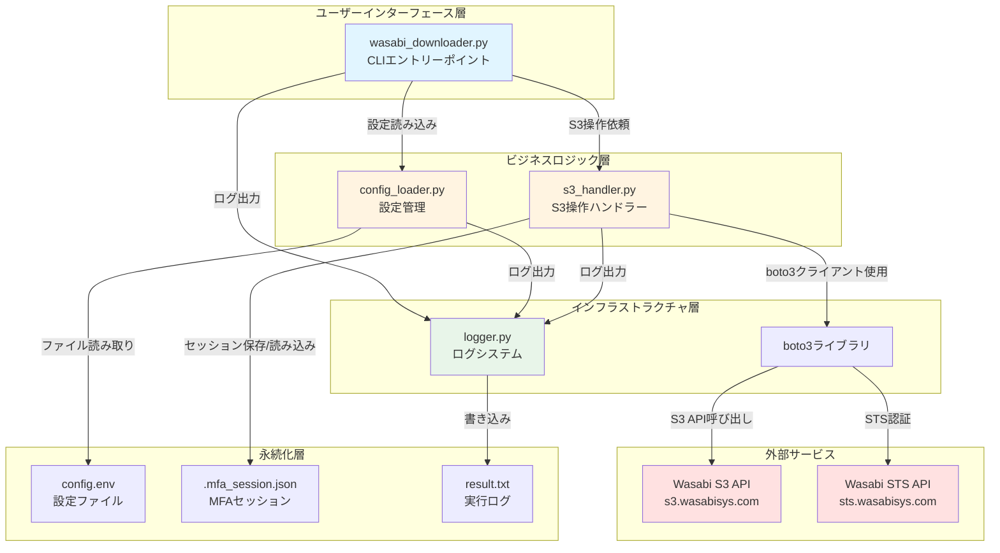
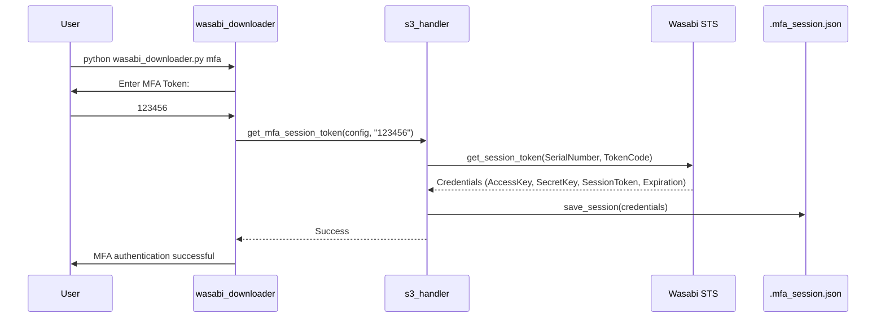
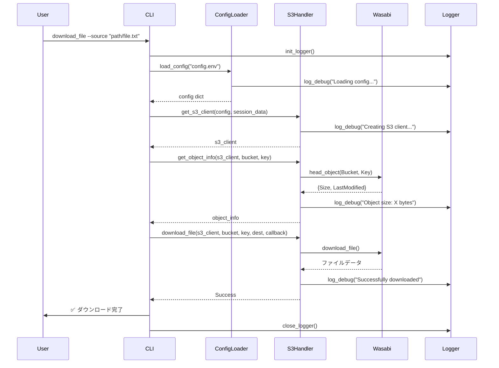
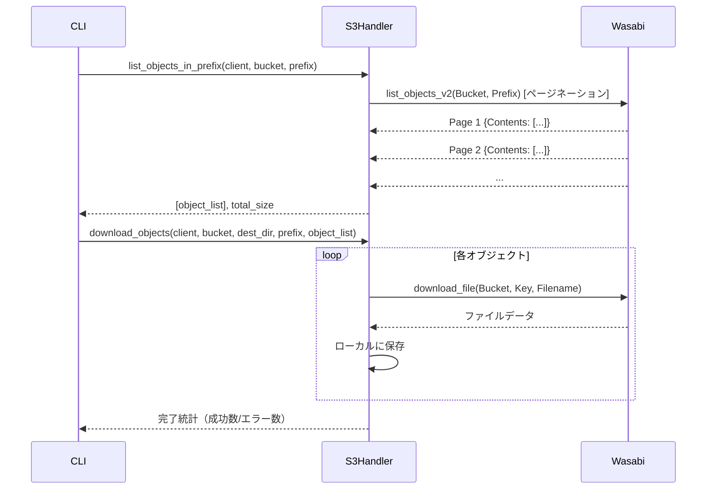
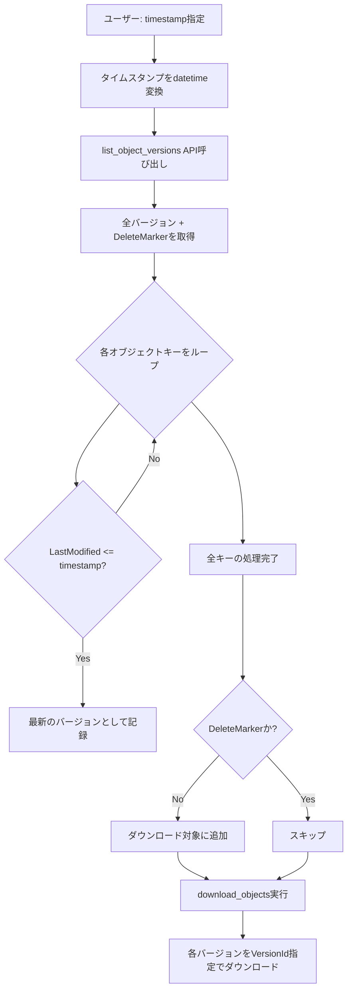
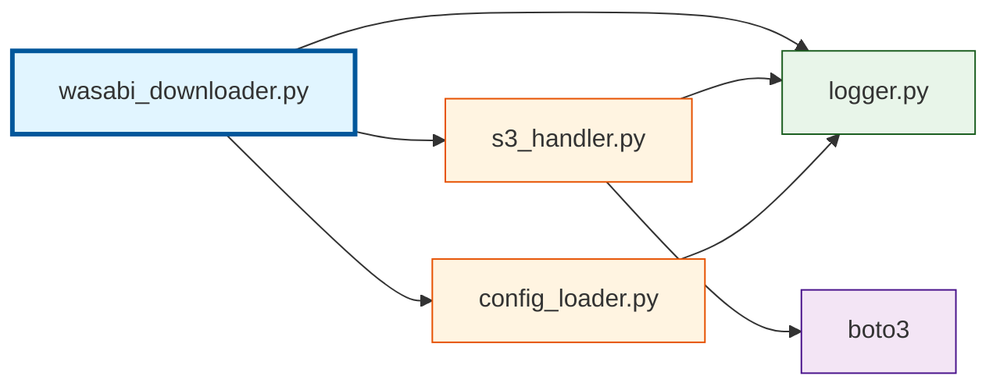

# Wasabi Downloader Blueprint
システム全体の設計と連携動作に関する技術資料

## 📋 目次
1. [システム概要](#システム概要)
2. [アーキテクチャ図](#アーキテクチャ図)
3. [コンポーネント詳細](#コンポーネント詳細)
4. [データフロー](#データフロー)
5. [認証とセッション管理](#認証とセッション管理)
6. [エラーハンドリング戦略](#エラーハンドリング戦略)
7. [セキュリティ設計](#セキュリティ設計)

---

## システム概要

**Wasabi Downloader** は、Wasabi Hot Cloud Storage（S3互換ストレージ）からファイルやディレクトリを効率的にダウンロードするためのPython製CLIツールです。

### 主要機能
- ✅ **単一ファイルダウンロード**: 特定のオブジェクトを指定してダウンロード
- ✅ **ディレクトリ一括ダウンロード**: プレフィックス配下の全ファイルを再帰的にダウンロード
- ✅ **バージョン管理対応**: 過去の特定時点でのファイル状態を一括復元
- ✅ **MFA認証サポート**: 多要素認証によるセキュアなアクセス
- ✅ **プロキシ対応**: カスタムSSL証明書を使用したプロキシ環境での動作
- ✅ **デバッグログ**: 全処理をタイムスタンプ付きで記録

### 技術スタック
- **言語**: Python 3.x
- **主要ライブラリ**: 
  - `boto3`: AWS SDK for Python（S3/STS操作）
  - `tqdm`: プログレスバー表示
- **認証プロトコル**: AWS STS (Security Token Service)
- **ストレージAPI**: S3互換API

---

## アーキテクチャ図



---

## コンポーネント詳細

### 1️⃣ wasabi_downloader.py
**役割**: CLIのエントリーポイントとコマンドルーティング

#### 主要機能
- コマンドライン引数のパース（`argparse`）
- サブコマンド実装:
  - `mfa`: MFA認証実行
  - `download_file`: 単一ファイルダウンロード
  - `download_dir`: ディレクトリ一括ダウンロード
  - `download_versioned`: タイムスタンプ指定バージョンダウンロード
  - `list_files`: ファイル一覧表示
- プログレスバー管理（tqdm）
- ロガーのライフサイクル管理（初期化→使用→クローズ）

#### 重要な処理フロー
```python
1. ロガー初期化 (logger.init_logger())
2. コマンド引数解析
3. 設定ファイル読み込み (config_loader.load_config())
4. MFAセッション検証（必要な場合）
5. S3クライアント取得 (s3_handler.get_s3_client())
6. コマンド実行
7. ロガークローズ (logger.close_logger())
```

#### 依存関係
```python
import config_loader  # 設定管理
import s3_handler     # S3操作
import logger         # ログシステム
```

---

### 2️⃣ s3_handler.py
**役割**: Wasabi S3/STSとの全ての通信を担当

#### 主要関数

| 関数名 | 機能 | 戻り値 |
|--------|------|--------|
| `get_mfa_session_token()` | STSでMFAトークン検証し、一時認証情報取得 | Dict[Credentials] |
| `save_session()` | 一時認証情報をJSONファイルに保存 | None |
| `load_session()` | 保存された認証情報を読み込み | Optional[Dict] |
| `is_session_valid()` | セッションの有効期限チェック | bool |
| `get_s3_client()` | S3クライアントインスタンス作成 | boto3.client |
| `get_object_info()` | 単一オブジェクトのメタデータ取得 | Dict[Key, Size, LastModified] |
| `list_objects_in_prefix()` | プレフィックス配下の全オブジェクトリスト | List[Objects], total_size |
| `list_object_versions_at_timestamp()` | 指定時刻の有効バージョンリスト | List[Versions], total_size |
| `download_file()` | 単一ファイルダウンロード | None |
| `download_objects()` | 複数オブジェクトバッチダウンロード | None |

#### 認証フロー（MFA有効時）


#### バージョン管理の仕組み
`list_object_versions_at_timestamp()`は以下のロジックで動作:
1. `list_object_versions` APIで全バージョンとDeleteMarkerを取得
2. 各オブジェクトキーごとに、指定タイムスタンプ以前の最新バージョンを特定
3. DeleteMarkerでない有効なバージョンのみをリストアップ

---

### 3️⃣ config_loader.py
**役割**: 環境設定ファイルの読み込みと検証

#### 処理ステップ
```python
1. config.envファイルをオープン
2. key=value形式でパース（コメント行と空行はスキップ）
3. 必須キーの存在確認:
   - aws_access_key_id
   - aws_secret_access_key
   - endpoint_url
   - bucket_name
   - sts_endpoint_url
4. オプションキーの処理:
   - mfa_serial_number: 空の場合はNoneに変換
   - ssl_verify_path: 空の場合はNoneに変換
5. Dict形式で設定を返却
```

#### バリデーション
- 必須キー不足時: `ValueError`をスロー
- ファイル不在時: `FileNotFoundError`をスロー

---

### 4️⃣ logger.py
**役割**: デュアル出力（コンソール + ファイル）ロギングシステム

#### 設計の特徴
- **シングルトンパターン**: グローバル`_global_logger`で全モジュールから同一インスタンスを使用
- **タイムスタンプ精度**: ミリ秒まで記録（`%Y-%m-%d %H:%M:%S.%f`）
- **ファイル自動フラッシュ**: 各ログ出力後に即座にディスク書き込み
- **コンテキストマネージャ対応**: `with`文で自動クローズ可能

#### ログレベル

| レベル | メソッド | 用途 |
|--------|----------|------|
| INFO | `log_info()` | 一般的な情報（コマンド開始、接続成功など） |
| DEBUG | `log_debug()` | 詳細なデバッグ情報（設定読み込み、API呼び出しなど） |
| WARNING | `log_warning()` | 警告（個別ファイルダウンロード失敗など） |
| ERROR | `log_error()` | エラー（認証失敗、設定エラーなど） |

#### ログファイル構造
```
================================================================================
Wasabi Downloader Execution Log
Started at: 2025-12-03 15:22:46
================================================================================

[2025-12-03 15:22:47.001] INFO: Starting command: list_files
[2025-12-03 15:22:47.002] DEBUG: Arguments: {'command': 'list_files', 'source': ''}
...
[2025-12-03 15:22:57.305] INFO: Total files found: 42

================================================================================
Execution ended at: 2025-12-03 15:22:57
================================================================================
```

---

## データフロー

### 📥 単一ファイルダウンロード (`download_file`)


---

### 📦 ディレクトリ一括ダウンロード (`download_dir`)


---

### ⏱️ バージョン指定ダウンロード (`download_versioned`)


---

## 認証とセッション管理

### MFA認証フロー

#### 1. 初回認証（`mfa`コマンド）
```python
# ユーザー操作
$ python wasabi_downloader.py mfa
Enter MFA Token: 123456

# 内部処理
1. config.envからmfa_serial_numberを取得
2. STSにget_session_token()リクエスト
   - SerialNumber: arn:aws:iam::...:mfa/user
   - TokenCode: 123456
3. STS応答:
   {
     "AccessKeyId": "ASIA...",
     "SecretAccessKey": "...",
     "SessionToken": "...",
     "Expiration": "2026-01-22T17:14:45Z"
   }
4. .mfa_session.jsonに保存
```

#### 2. セッション再利用（他コマンド実行時）
```python
# 内部処理
1. .mfa_session.jsonが存在するかチェック
2. is_session_valid()で有効期限確認
   - Expiration > 現在時刻 + 1分 → 有効
   - それ以外 → エラー
3. 有効な場合、セッション情報をget_s3_client()に渡す
4. boto3がSessionTokenを使用してS3 API呼び出し
```

### セッション有効期限
- **デフォルト**: STSトークンは通常12時間有効
- **バッファ**: 有効期限の1分前に無効と判定（安全マージン）
- **期限切れ時**: `ValueError`をスローし、再度`mfa`コマンド実行を促す

---

## エラーハンドリング戦略

### エラー分類と対処

| エラータイプ | 発生源 | 処理 | ユーザーへの影響 |
|-------------|--------|------|------------------|
| **設定ファイルエラー** | config_loader.py | `FileNotFoundError`/`ValueError`スロー → CLI層でキャッチしてログ出力 | プログラム終了（exit 1） |
| **認証エラー** | s3_handler.py | `ClientError`スロー | プログラム終了（exit 1） |
| **MFAセッション期限切れ** | s3_handler.py | `ValueError`スロー | エラーメッセージ表示、`mfa`コマンド再実行を促す |
| **単一オブジェクトダウンロード失敗** | download_file | 例外スロー | プログラム終了 |
| **バッチダウンロード中の個別失敗** | download_objects | `WARNING`ログ出力、処理継続 | 他ファイルのダウンロードは継続 |
| **オブジェクト不在** | get_object_info | `FileNotFoundError`スロー | プログラム終了 |

### 例外ハンドリングパターン
```python
# wasabi_downloader.py
try:
    # メイン処理
    config = config_loader.load_config(config_path)
    s3_client = s3_handler.get_s3_client(config, session_data=session_data)
    # ...
except (FileNotFoundError, ValueError, ClientError) as e:
    logger.log_error(str(e))
    sys.exit(1)
except Exception as e:
    logger.log_error(f"An unexpected error occurred: {e}")
    sys.exit(1)
finally:
    logger.close_logger()  # 必ずログをクローズ
```

---

## セキュリティ設計

### 🔐 認証情報の保護

#### 原則
1. **ソースコードにハードコーディングしない**: 全て`config.env`から読み込み
2. **一時認証情報の使用**: MFA有効時はSTS一時トークンを使用
3. **セッションファイルの権限**: `.mfa_session.json`はローカルファイルシステムの権限で保護

#### config.envの管理
```bash
# .gitignoreに追加必須
config.env
.mfa_session.json
result.txt
```

### 🌐 プロキシ環境とSSL検証

#### 課題
企業内プロキシでSSLインスペクションが行われる環境では、Wasabiの証明書検証が失敗する。

#### 解決策
`ssl_verify_path`にカスタムCA証明書のパスを指定:
```env
ssl_verify_path=C:\certs\corporate-proxy-ca.pem
```

#### 実装
```python
# s3_handler.py
if config.get('ssl_verify_path'):
    logger.log_debug(f"Using custom SSL certificate: {config['ssl_verify_path']}")
    client_params['verify'] = config['ssl_verify_path']

s3_client = boto3.client('s3', **client_params)
```

boto3は`verify`パラメータに証明書パスを渡すことで、カスタムCA証明書を使用して検証を行う。

### 🛡️ MFA (多要素認証)

#### 有効化条件
`config.env`に以下を設定:
```env
mfa_serial_number=arn:aws:iam::123456789012:mfa/username
```

#### セキュリティメリット
- 認証情報が万一漏洩しても、MFAコードなしでは操作不可
- 一時トークンは有効期限付きのため、永続的な認証情報よりリスク低減
- 最小権限の原則に準拠（IAMポリシーでMFA必須条件を設定可能）

---

## 付録

### ディレクトリ構造
```
BC1-feature-separate-mfa-command/
├── wasabi_downloader.py    # エントリーポイント
├── s3_handler.py            # S3/STS操作
├── config_loader.py         # 設定管理
├── logger.py                # ロギングシステム
├── config.env               # 環境設定（要手動作成）
├── requirements.txt         # 依存ライブラリ
├── README.md                # ユーザー向けドキュメント
├── blueprint.md             # 本ドキュメント
├── Compailation.md          # PyInstallerビルド手順
├── LOG_FEATURE.md           # ログ機能詳細
├── .mfa_session.json        # MFAセッション（自動生成）
└── result.txt               # 実行ログ（自動生成）
```

### 依存関係グラフ


### 主要な設計パターン

| パターン | 適用箇所 | 目的 |
|---------|---------|------|
| **Facade Pattern** | s3_handler.py | boto3の複雑なAPIを簡潔なインターフェースでラップ |
| **Singleton Pattern** | logger.py | グローバルロガーで全モジュールから同一インスタンスを使用 |
| **Strategy Pattern** | download_file/download_dir/download_versioned | コマンドごとに異なるダウンロード戦略を実装 |
| **Dependency Injection** | get_s3_client() | 設定やセッションデータを外部から注入 |

---

## 変更履歴

| 日付 | 変更内容 |
|------|---------|
| 2026-01-22 | 初版作成 - システム全体のブループリント記述 |

---

**Document Version**: 1.0  
**Last Updated**: 2026-01-22  
**Author**: Antigravity
